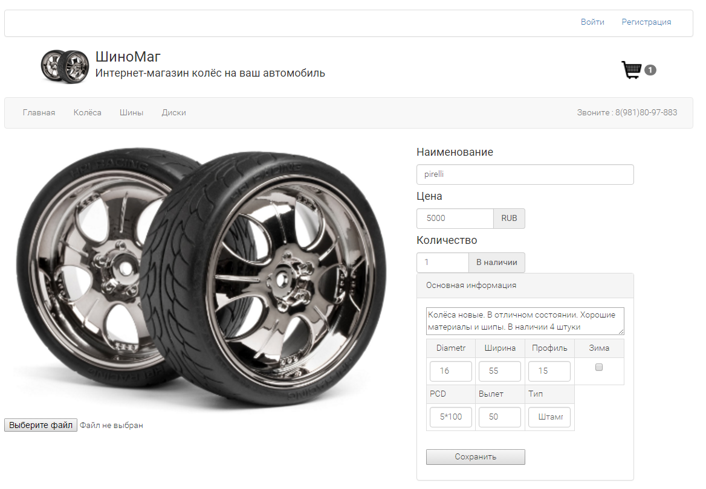

Инетернет магазин
===========================
Быстрый старт
---------------------------
(Я пользуюсь OpenServer, и все команды ввожу в консоле openserver'а)
>**1.**В папке с вашими проектами выполните команду **git clone** https://github.com/Mishanya840/WheelShop.git

>**2.**Установить [Composer](https://getcomposer.org/)

>**3.**Запустить установку библиотек через Composer командой ```composer install```

>**4.**Настроить Apache_vhost
```
<VirtualHost *:80>
    DocumentRoot    "C:\OpenServer\domains\WheelShop\public"
    ServerName      "Wheelshop"
</VirtualHost>
```


>**5.**Создать файл .evn по примеру файла .env.example и Базу Данных.

>**6.**Создать таблицы командой ```php artisan migrate```

>**7.**Создать администратора ```php artisan db:seed --class=UserTableSeeder```(Так же можно наполнить сайт контентом для примера коммандой ```php artisan db:seed```)

Описание проекта
---------------------------
Это курсовой проект, в котором я, используя laravel, bootstrap 3 и jquery, сделал интернет-магазин автомобильных дисков и шин. Сайт имеет корзину, авторизацию пользователей и страницу администратора с возможностями добавления, изменения и удаления.

Главная страница
---------------------------


На главной странице мы можем зарегестрироваться или войти, нажав сообветствуюшие ссылки в самом верху страницы. Ниже расположен логотип, который при клике переводит на главную страницу, и корзина, отображающая количество товаров в корзине(количество отличных товаров).
Ниже расположена навигационная панель и контактный номер телефона, затем разположены слайдеры всех видов товаров.
Внизу сайта расположена информация для связи, 4 ссылки на информационные страницы, информация о способах оплаты.

Авторизация
---------------------------


На страницах регистрации и входи расположены простые формы.

Список товаров
---------------------------


На страницах "Колёса", "Шины", "Диски" отобрадается список всех товаров данной категории. Каждый товар имеет фото, название, описание и цену.

Информация о товаре
---------------------------


На странице о товаре мы видим всю информацию о товаре, имеем возможность выбрать нужное количество и добавить в корзину. Если вы зашли от имени администратора, то на этой странице вы сможете менять всю инфирмацию о товаре, по окончанию изменения необходимо нажать "Сохранить".
Фото у товара может быть только одна.

Корзина
---------------------------

В корзине отображаются товары, которые вы сюда добавили. О каждом товаре отображается основная информация, а также количество к покупке и стоимость.
При нажатии "Оформить заказ", ваш заказ сохраняется, продавец видет его и связывается с вами.

Добавление нового товара
---------------------------


Если вы администратор, на главной странице вверху вы найдёте ссылку "Добавить товар", после нажатия на неё вы попадёте на страницу, на которой вы можете добавить новый товар. Заполните поля и нажмите "Добавить"
